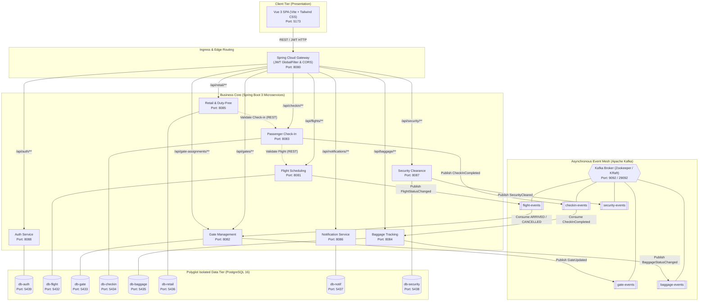
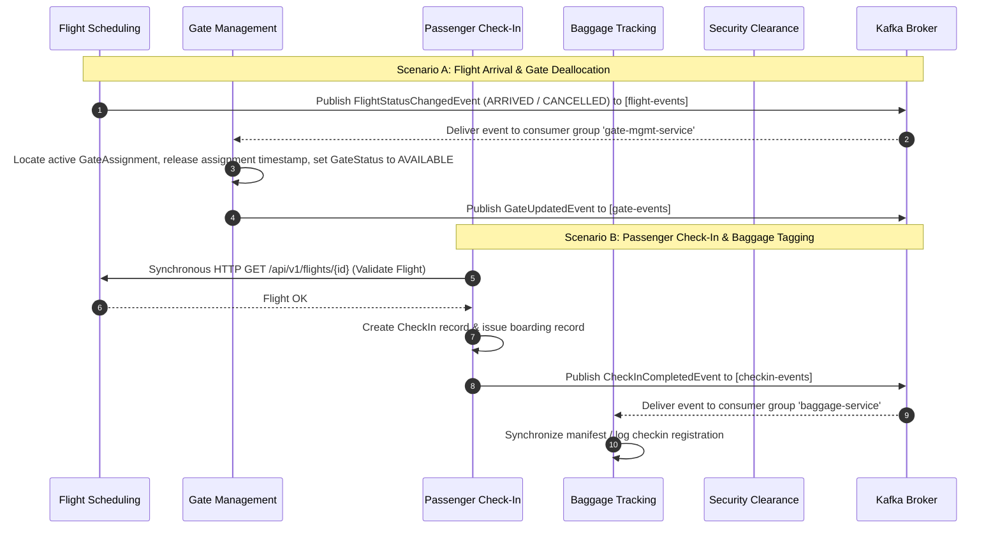

# SkyPort — Distributed Airport Management System

[](https://openjdk.org/)
[](https://spring.io/projects/spring-boot)
[](https://spring.io/projects/spring-cloud-gateway)
[](https://vuejs.org/)
[](https://vitejs.dev/)
[](https://kafka.apache.org/)
[](https://www.postgresql.org/)
[](https://www.docker.com/)

> **Executive Overview**  
> **SkyPort** is a cloud-native, distributed airport management platform engineered to orchestrate mission-critical aviation operations at scale. By harmonizing an event-driven messaging mesh with domain-isolated persistence, SkyPort delivers real-time flight telemetry, automated gate allocation, zero-trust passenger check-in with synchronized baggage drop, biometric security clearance tracking, and gate-validated duty-free retail transactions.

---

## Table of Contents
- [1. System Architecture & Event Mesh](#1-system-architecture--event-mesh)
  - [Architectural Patterns](#architectural-patterns)
  - [End-to-End Architecture Diagram](#end-to-end-architecture-diagram)
  - [Event Topology Diagram](#event-topology-diagram)
- [2. Service Topology & Port Directory](#2-service-topology--port-directory)
- [3. Technology Stack Matrix](#3-technology-stack-matrix)
- [4. End-to-End Business Workflows](#4-end-to-end-business-workflows)
  - [Flight Lifecycle & Automated Gate Clearing](#workflow-1-flight-lifecycle--automated-gate-clearing)
  - [Passenger Check-In & Baggage Tagging](#workflow-2-passenger-check-in--baggage-tagging)
  - [Security Screening & Incident Escalation](#workflow-3-security-screening--incident-escalation)
  - [Duty-Free Verification & Order Fulfilment](#workflow-4-duty-free-verification--order-fulfilment)
- [5. Quickstart & Local Setup](#5-quickstart--local-setup)
  - [Prerequisites](#prerequisites)
  - [Single-Command Boot (Full Stack)](#single-command-boot-full-stack)
  - [Targeted Infrastructure Boot (Dev Mode)](#targeted-infrastructure-boot-dev-mode)
  - [Endpoint Directory & Swagger Dashboards](#endpoint-directory--swagger-dashboards)
  - [Default Credentials & Authentication](#default-credentials--authentication)
  - [Automated Smoke Test / Data Seeding](#automated-smoke-test--data-seeding)
- [6. Local Development Guide](#6-local-development-guide)
  - [Root Maven Aggregator Build](#root-maven-aggregator-build)
  - [Frontend Hot-Reload Environment](#frontend-hot-reload-environment)
  - [Running Unit & MockMvc Tests](#running-unit--mockmvc-tests)
- [7. Academic & Engineering Context](#7-academic--engineering-context)
  - [University of Tartu Capstone Context](#university-of-tartu-capstone-context)
  - [Engineering Challenges & Trade-offs](#engineering-challenges--trade-offs)
  - [Engineering Team & Module Ownership](#engineering-team--module-ownership)

---

## 1. System Architecture & Event Mesh

### Architectural Patterns

SkyPort implements industry-standard distributed systems patterns to maintain resilience, fault isolation, and horizontal scalability:

1. **Database-per-Service Pattern**: Each business capability owns an isolated PostgreSQL database container and schema. Services communicate exclusively via contract-defined REST APIs and asynchronous Kafka events, eliminating distributed locking and schema coupling.
2. **Event-Driven Architecture (EDA)**: State transitions (such as flight arrival, passenger check-in completion, or security clearance updates) are broadcast to Apache Kafka topics. Downstream services consume these events reactively to execute business logic (e.g., releasing airport gates or generating baggage records).
3. **API Gateway & Token Relay Pattern**: A reactive Spring Cloud Gateway serves as the single unified reverse proxy on port `8080`. It terminates CORS, intercepts unauthenticated requests via a high-order `GlobalFilter`, validates HMAC-SHA256 JWT tokens, and decorates downstream requests with identity claims (`X-User-Id`, `X-User-Role`).
4. **Decoupled Synchronous Validation with Resilience**: Where strict read consistency is required (e.g., duty-free purchase verification against passenger check-in status), services utilize configurable HTTP clients with timeout bounds and fallback switches (`FLIGHT_VALIDATION_ENABLED`, `CHECKIN_VALIDATION_ENABLED`).

### End-to-End Architecture Diagram



### Event Topology Diagram



---

## 2. Service Topology & Port Directory

All services run inside containerized environments with standardized port allocations. In production and Docker Compose environments, communication traverses service DNS hostnames over private bridge networks.

| Service Name | Gateway Route | Host Port | Database / Storage | Key Responsibilities | Consumed / Published Events |
|:---|:---|:---:|:---|:---|:---|
| **api-gateway** | `/*` | `8080` | Memory (Stateless) | Ingress reverse proxy, JWT signature verification, CORS enforcement, request decoration (`X-User-Id`, `X-User-Role`), route rewriting. | N/A |
| **auth-service** | `/api/auth/**` | `8088` | PostgreSQL (`auth_service`:5439) | User registration, credential verification (BCrypt), HMAC-SHA256 JWT generation with role-based claims (`ADMIN`, `PASSENGER`). | None |
| **flight-scheduling-service** | `/api/flights/**` | `8081` | PostgreSQL (`flight_scheduling`:5432) | Flight master data management, airline codes, schedules, departure/arrival tracking, lifecycle state machine (`SCHEDULED`, `BOARDING`, `DEPARTED`, `ARRIVED`, `CANCELLED`). | **Publishes**: `flight-events` (`FlightStatusChangedEvent`) |
| **gate-management-service** | `/api/gates/**`, `/api/gate-assignments/**` | `8082` | PostgreSQL (`gate_management`:5433) | Terminal gate allocation, availability states (`AVAILABLE`, `OCCUPIED`, `MAINTENANCE`), automated release upon flight arrival or cancellation. | **Consumes**: `flight-events`<br/>**Publishes**: `gate-events` (`GateUpdatedEvent`) |
| **passenger-checkin-service** | `/api/checkin/**` | `8083` | PostgreSQL (`passenger_checkin`:5434) | Passenger check-in processing, seat reservation, baggage drop tracking, boarding pass generation, synchronous flight existence check. | **Publishes**: `checkin-events` (`CheckInCompletedEvent`, `CheckInStatusChangedEvent`) |
| **baggage-tracking-service** | `/api/baggage/**` | `8084` | PostgreSQL (`baggage_tracking`:5435) | Baggage registration, barcode tag tracking, luggage status transitions (`CHECKED_IN`, `SCREENING`, `LOADED`, `TRANSFER`, `CLAIMED`, `LOST`). | **Consumes**: `checkin-events`<br/>**Publishes**: `baggage-events` (`BaggageRegisteredEvent`, `BaggageStatusChangedEvent`) |
| **retail-dutyfree-service** | `/api/retail/**` | `8085` | PostgreSQL (`retail_dutyfree`:5436) | Duty-free inventory catalog, order creation, boarding verification check (guaranteeing passenger is checked in prior to purchase). | None (Synchronous HTTP to Check-In) |
| **notification-service** | `/api/notifications/**` | `8086` | PostgreSQL (`notification`:5437) | Flight status alerts, passenger broadcast messaging, multi-channel notification templating and transmission logs. | REST Ingress / Broadcast Log |
| **security-clearance-service** | `/api/security/**` | `8087` | PostgreSQL (`security_clearance`:5438) | Passenger biometric/security clearance status (`PENDING`, `CLEARED`, `FLAGGED`, `REJECTED`), incident logging, security breach alerts. | **Publishes**: `security-events` (`SecurityClearedEvent`) |
| **frontend** | N/A | `5173` | LocalStorage (`ams_auth`) | Vue 3 Single Page Application with separate Passenger Portal, Airport Management Dashboard, and Live Flight Information Display Systems (FIDS). | N/A |
| **kafka** | Broker | `9092` | KRaft / Zookeeper (`2181`) | Distributed commit log for inter-service event communication across topics. | All Kafka Topics |

---

## 3. Technology Stack Matrix

```
┌────────────────────────────────────────────────────────────────────────┐
│                              SKYPORT STACK                             │
├────────────────────────────────────────────────────────────────────────┤
│  Client Tier     │ Vue 3.5 (Composition API) • Vite 8 • Vue Router 4   │
│                  │ Tailwind CSS • Axios • Vite DevTools                │
├──────────────────┼─────────────────────────────────────────────────────┤
│  Edge Ingress    │ Spring Cloud Gateway 2023 • JJWT (HMAC-SHA256)      │
│                  │ Reactive Netty • CORS Configuration Filter          │
├──────────────────┼─────────────────────────────────────────────────────┤
│  Business Tier   │ Spring Boot 3.2.5 • Spring Data JPA • Hibernate     │
│                  │ Spring Security (Crypto) • Spring Validation        │
│                  │ Springdoc OpenAPI 2.3.0 (Swagger UI 3.0)            │
├──────────────────┼─────────────────────────────────────────────────────┤
│  Event Mesh      │ Apache Kafka 7.6 (Confluent Platform)               │
│                  │ Spring for Apache Kafka (JsonSerializer / Deserial) │
├──────────────────┼─────────────────────────────────────────────────────┤
│  Persistence     │ PostgreSQL 16 (8 isolated instances in Docker)      │
│                  │ Hibernate DDL update & schema separation            │
├──────────────────┼─────────────────────────────────────────────────────┤
│  DevOps & Quality│ Docker Engine 24+ • Docker Compose v2 (Profiles)    │
│                  │ Apache Maven 3.9 Multi-Module Aggregator            │
│                  │ JUnit 5 • MockMvc • Qodana Static Code Inspection   │
└────────────────────────────────────────────────────────────────────────┘
```

---

## 4. End-to-End Business Workflows

### Workflow 1: Flight Lifecycle & Automated Gate Clearing
1. An operations manager schedules a flight via `POST /api/flights` with flight number, origin, destination, and timestamps.
2. The gate dispatcher assigns a physical gate via `POST /api/gate-assignments`. The gate status shifts to `OCCUPIED`.
3. When the flight reaches terminal status (`ARRIVED` or `CANCELLED`) via `PATCH /api/flights/{id}/status`:
   - `flight-scheduling-service` updates its database and publishes `FlightStatusChangedEvent` to `flight-events`.
   - `gate-management-service`'s `@KafkaListener(topics = "flight-events")` detects the terminal state.
   - It marks the assignment's `releasedAt` timestamp and automatically resets the gate to `AVAILABLE`, eliminating deadlocks and manual gate deallocation errors.

### Workflow 2: Passenger Check-In & Baggage Tagging
1. A traveler authenticates and initiates check-in through `POST /api/checkin`.
2. `passenger-checkin-service` invokes `HttpFlightValidationClient` to verify the flight exists in `flight-scheduling-service` via synchronous HTTP.
3. Upon persistence, `passenger-checkin-service` emits `CheckInCompletedEvent` onto `checkin-events`.
4. `baggage-tracking-service` receives the event asynchronously to pre-seed the passenger's luggage profile.
5. The traveler registers luggage items via `POST /api/baggage`. Each piece receives an automated tracking barcode, initial status `CHECKED_IN`, and triggers `BaggageRegisteredEvent` onto `baggage-events`.

### Workflow 3: Security Screening & Incident Escalation
1. Passengers undergo screening logged via `POST /api/security/clearances`.
2. Clearances transition from `PENDING` to `CLEARED`, `FLAGGED`, or `REJECTED`.
3. When cleared, `SecurityEventsPublisher` emits `SecurityClearedEvent` onto `security-events`.
4. If a safety breach or suspicious luggage is detected, agents record an incident via `POST /api/security/incidents`, generating security incident logs for airport law enforcement.

### Workflow 4: Duty-Free Verification & Order Fulfilment
1. A passenger browses the airport catalog via `GET /api/retail/products`.
2. When placing an order via `POST /api/retail/orders`, the `retail-dutyfree-service` calls `HttpCheckInValidationClient` to execute a synchronous verification:
   ```
   GET http://passenger-checkin-service:8083/api/v1/checkins/passenger/{id}/flight/{id}
   ```
3. If the traveler is not confirmed as checked in, the order is rejected (`400 Bad Request`), preventing unauthorized duty-free purchases by non-ticketed visitors.

---

## 5. Quickstart & Local Setup

### Prerequisites
- **Docker Engine**: Version 24.0 or higher
- **Docker Compose**: Version 2.20 or higher
- **Java Development Kit (JDK)**: OpenJDK 21 (or 17+)
- **Node.js**: Version 20.19.0 LTS or higher (`npm v10+`)
- **Apache Maven**: Version 3.9+ (optional if using Docker)

---

### Single-Command Boot (Full Stack)

To launch the complete distributed system—including all 8 PostgreSQL databases, Zookeeper, Apache Kafka, all 9 Spring Boot microservices, and the Vue 3 frontend—run the following command from the repository root:

```bash
docker compose --profile apps up --build
```

> [!TIP]
> The first run compiles all Java services inside a clean Maven container cache. Subsequent starts will execute in seconds.

To stop the entire cluster and preserve volume states:
```bash
docker compose --profile apps down
```

To purge all containers, networks, and persistent database volumes:
```bash
docker compose --profile apps down -v
```

---

### Targeted Infrastructure Boot (Dev Mode)

If you are developing backend microservices or the frontend inside your local IDE with hot reloading, start **only** the backing infrastructure (PostgreSQL databases, Zookeeper, and Kafka):

```bash
docker compose up -d
```

This boots:
- All 8 PostgreSQL instances on host ports `5432` through `5439`
- Zookeeper on host port `2181`
- Apache Kafka on host port `9092`

You can then run any specific Spring Boot microservice locally via `mvn spring-boot:run` or your IDE runner.

---

### Endpoint Directory & Swagger Dashboards

Once booted, the following interactive services are accessible:

| Component | URL | Description |
|:---|:---|:---|
| **Frontend Portal** | [http://localhost:5173](http://localhost:5173) | Primary User Interface (Passenger & Management portals) |
| **API Gateway** | [http://localhost:8080](http://localhost:8080) | Unified REST Ingress & JWT Proxy |
| **Auth Service Swagger** | [http://localhost:8088/swagger-ui.html](http://localhost:8088/swagger-ui.html) | Identity & Access OpenAPI Documentation |
| **Flight Scheduling Swagger** | [http://localhost:8081/swagger-ui.html](http://localhost:8081/swagger-ui.html) | Flight Operations OpenAPI Documentation |
| **Gate Management Swagger** | [http://localhost:8082/swagger-ui.html](http://localhost:8082/swagger-ui.html) | Gate Allocations OpenAPI Documentation |
| **Passenger Check-In Swagger**| [http://localhost:8083/swagger-ui.html](http://localhost:8083/swagger-ui.html) | Check-in & Boarding OpenAPI Documentation |
| **Baggage Tracking Swagger** | [http://localhost:8084/swagger-ui.html](http://localhost:8084/swagger-ui.html) | Luggage Barcode OpenAPI Documentation |
| **Retail & Duty-Free Swagger** | [http://localhost:8085/swagger-ui.html](http://localhost:8085/swagger-ui.html) | Duty-Free Store OpenAPI Documentation |
| **Notification Service Swagger**| [http://localhost:8086/swagger-ui.html](http://localhost:8086/swagger-ui.html) | Alert Broadcast OpenAPI Documentation |
| **Security Clearance Swagger** | [http://localhost:8087/swagger-ui.html](http://localhost:8087/swagger-ui.html) | Security Clearance OpenAPI Documentation |

---

### Default Credentials & Authentication

SkyPort enforces role-based access control with two primary user roles:
- `ADMIN`: Full access to the Management Portal (flight dispatch, gate assignment, duty-free inventory).
- `PASSENGER`: Access to Passenger Dashboard, Check-In, Baggage Tracking, and Flight Boards.

You can register user accounts directly from the UI at [http://localhost:5173/auth](http://localhost:5173/auth) or via cURL:

#### 1. Register an Administrator
```bash
curl -s -X POST http://localhost:8080/api/auth/register \
  -H "Content-Type: application/json" \
  -d '{
    "username": "admin",
    "password": "adminpassword",
    "role": "ADMIN"
  }'
```

#### 2. Register a Passenger
```bash
curl -s -X POST http://localhost:8080/api/auth/register \
  -H "Content-Type: application/json" \
  -d '{
    "username": "john_doe",
    "password": "passengerpass",
    "role": "PASSENGER"
  }'
```

#### 3. Sign In & Obtain JWT Token
```bash
curl -s -X POST http://localhost:8080/api/auth/login \
  -H "Content-Type: application/json" \
  -d '{
    "username": "admin",
    "password": "adminpassword"
  }'
```
Response:
```json
{
  "userId": 1,
  "username": "admin",
  "role": "ADMIN",
  "token": "eyJhbGciOiJIUzI1NiJ9..."
}
```

---

### Automated Smoke Test / Data Seeding

After starting the system, execute the following script to seed initial flights, gates, products, and check-in records:

```bash
# 1. Login and extract Bearer token
TOKEN=$(curl -s -X POST http://localhost:8080/api/auth/login \
  -H "Content-Type: application/json" \
  -d '{"username":"admin","password":"adminpassword"}' | grep -o '"token":"[^"]*' | cut -d'"' -f4)

# 2. Create a Scheduled Flight
curl -X POST http://localhost:8080/api/flights \
  -H "Authorization: Bearer $TOKEN" \
  -H "Content-Type: application/json" \
  -d '{
    "flightNumber": "TK1423",
    "airlineCode": "TK",
    "aircraftType": "Airbus A321neo",
    "origin": "IST",
    "destination": "TLL",
    "scheduledDeparture": "2026-09-04T10:00:00",
    "scheduledArrival": "2026-09-04T13:30:00"
  }'

# 3. Create a Terminal Gate
curl -X POST http://localhost:8080/api/gates \
  -H "Authorization: Bearer $TOKEN" \
  -H "Content-Type: application/json" \
  -d '{
    "gateNumber": "G12",
    "terminal": "Terminal 1",
    "status": "AVAILABLE"
  }'

# 4. Add a Duty-Free Product
curl -X POST http://localhost:8080/api/retail/products \
  -H "Authorization: Bearer $TOKEN" \
  -H "Content-Type: application/json" \
  -d '{
    "name": "Nordic Juniper Gin 1L",
    "category": "BEVERAGES",
    "price": 38.50,
    "stockQuantity": 150
  }'
```

---

## 6. Local Development Guide

### Root Maven Aggregator Build

The root repository contains a Maven aggregator project that builds and tests all 9 backend microservices in topological order with a single command:

```bash
# Compile and package all services into executable JARs
mvn clean install -DskipTests

# Or compile and execute surefire tests across all microservices
mvn clean test
```

To build an individual microservice:
```bash
cd backend/flight-scheduling-service
mvn spring-boot:run
```

---

### Frontend Hot-Reload Environment

The frontend is built with **Vue 3** and **Vite**, featuring instant Hot Module Replacement (HMR):

```bash
cd frontend

# Install Node dependencies
npm install

# Start Vite local development server (proxies /api to localhost:8080)
npm run dev
```

The Vite dev server will start at `http://localhost:5173`. Incoming `/api` requests are automatically proxied to the API Gateway at `http://localhost:8080`.

To build the production bundle:
```bash
npm run build
```

---

### Running Unit & MockMvc Tests

All microservices contain unit and MockMvc integration test suites:

```bash
# Run tests for all services from root
mvn test

# Run tests for a specific service (e.g. Passenger Check-In)
mvn test -pl backend/passenger-checkin-service
```

---

## 7. Academic & Engineering Context

### University of Tartu Capstone Context
SkyPort was engineered as a capstone project within the **Institute of Computer Science at the University of Tartu**, Estonia. The project serves as an end-to-end demonstration of modern enterprise software engineering, distributed systems architecture, asynchronous event propagation, and domain-driven design (DDD).

### Engineering Challenges & Trade-offs

1. **Dual-Path Consistency Model**:
   A fundamental challenge in distributed aviation systems is deciding between immediate consistency and eventual consistency. SkyPort combines:
   - *Synchronous HTTP RPC* for high-integrity operations that cannot proceed without confirmation (e.g., verifying passenger check-in eligibility before authorizing duty-free alcohol purchases).
   - *Asynchronous Kafka Event Mesh* for high-throughput operational state changes (e.g., flight status updates triggering gate deallocation), allowing services to stay responsive even under network partitions or high consumer load.

2. **Decoupling and Fault Tolerance**:
   Each synchronous integration point is accompanied by an environment variable fallback flag (`FLIGHT_VALIDATION_ENABLED`, `CHECKIN_VALIDATION_ENABLED`). This allows microservices to be tested in complete isolation without running the entire upstream topology.

3. **Stateless Edge Security with Claim Propagation**:
   Rather than requiring every downstream microservice to interact with a centralized identity store or duplicate JWT parsing logic, the Spring Cloud Gateway verifies the token signature at the edge. It then injects `X-User-Id` and `X-User-Role` headers into downstream requests, reducing latency across internal microservice calls.

### Engineering Team & Module Ownership

| Engineer | Core Responsibilities & Domain Services |
|:---|:---|
| **Ibrahim** | Flight Scheduling Service, Gate Management Service, Flight-to-Gate Event Automation |
| **Umid** | Passenger Check-In Service, Security Clearance & Incidents, Inter-service Flight Validation |
| **Tofig** | Baggage Tracking Service, Retail & Duty-Free Service, Boarding Pass Verification |
| **Kanan** | API Gateway Routing, JWT Ingress Filter, Apache Kafka Event Infrastructure, Auth Service |

---

<div align="center">
  <sub>Built with engineering rigor at the <strong>University of Tartu</strong>. Licensed under the MIT License.</sub>
</div>
